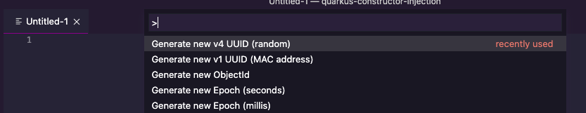

# theid

VS Code extension `theid` is a contraction of `the id`. It is an
ID generator. Useful for generating IDs such as UUIDs.

Check the release notes below for the list of what IDs can be
generated.

## Features

Adds useful ID generators to VS Code:

## Release Notes

### 0.0.1

+ Initial release, generates v4 UUIDs and MongoDB ObjectIDs.

### 0.0.2

+ More generators added by [@ashatch](https://github.com/ashatch)
  + v1 UUIDs
  + Epoch in millis and seconds

### 0.0.3

+ Update README

### 0.0.4

+ Add Marketplace icon from [@ashatch](https://github.com/ashatch)

See [CHANGELOG.md](CHANGELOG.md) for detailed release notes.
